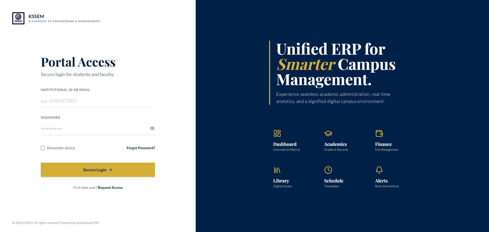
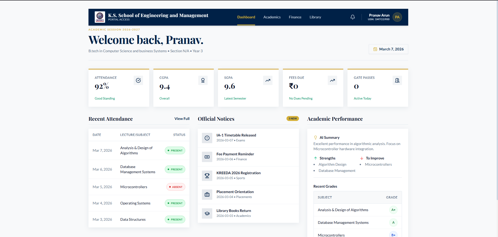
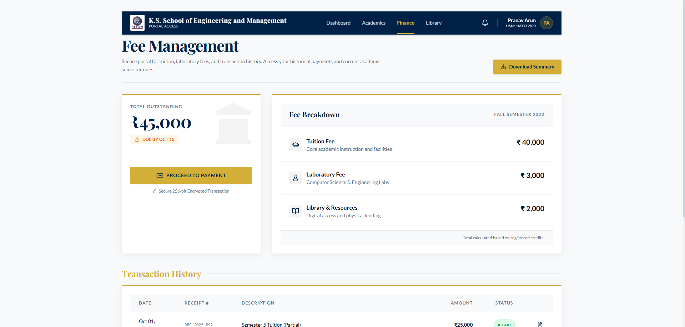
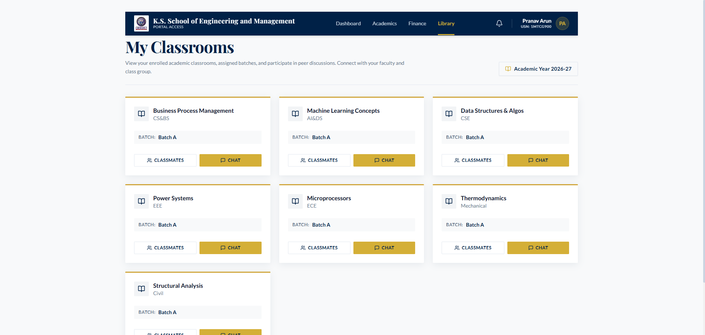

#  KSSEM College ERP System

[](https://www.gnu.org/licenses/gpl-3.0)


A full-stack College ERP system for managing student records, attendance, grades, real-time classroom chat, and admin operations — built for KSSEM, Bengaluru.

## System Preview

|                  Landing Page                  |             Portal Dashboard              |
| :--------------------------------------------: | :---------------------------------------: |
|  |  |

|                Fee Management                |             Digital Classroom             |
| :------------------------------------------: | :---------------------------------------: |
|  |  |

## Architecture

This is a two-part system:

- **Frontend** — Next.js + React + TypeScript + TailwindCSS, deployed on **Vercel**. Handles UI, client-side Firebase Auth, and calls the backend over REST.
- **Backend** — a single Go module (`server/`) deployed on **Render**, backed by Cloud Firestore and Firebase Auth. Handles all data access, business logic, and authorization.

The frontend never talks to Firestore for application data (profiles, grades, attendance, admin operations, chat) — every one of those goes through the Go backend's REST API. The one deliberate exception is the app's display name in the root layout, which reads Firestore directly (cached, read-only, revalidated hourly) purely to avoid an extra network round-trip on every page load — this is why the frontend, not just the backend, needs its own Firebase service account credentials (see setup below).

Real-time chat runs over Server-Sent Events (SSE) from an in-memory event hub inside the Go backend — no external message broker.

Admin authorization is enforced via **Firebase custom claims** on the JWT, not the Firestore `role` field directly — see [Promoting a User to Admin](#promoting-a-user-to-admin) below.

See [`ARCHITECTURE.md`](ARCHITECTURE.md) for the full breakdown, including the migration history and real bugs found along the way.

## What You'll Need (Prerequisites)

- **Node.js** (LTS) and `pnpm`
- **Go** (1.22+) — for running the backend locally
- **A Google Account** — to create a Firebase project
- **An Email Account (SMTP)** — for sending notifications (Gmail App Password, SendGrid, etc.)

## Understanding a Few Basic Terms

- **Firebase Auth** — handles user accounts and login (email/password).
- **Cloud Firestore** — the database. Owned and accessed exclusively by the Go backend, except for the one cached read described above.
- **Go backend (`server/`)** — a single Go binary exposing REST endpoints (`/api/academic/*`, `/api/admin/*`, `/api/communication/*`) plus an SSE endpoint for chat.
- **Service Account Key** — a JSON credential giving server-side code admin access to Firebase. Needed by **both** the frontend and the backend, for different reasons (see above).
- **Custom Claims** — a piece of data attached to a user's Firebase Auth token (separate from their Firestore document) that the backend checks to decide if they're an admin.

## Initial Setup Guide

### Step 1: Install Node.js, pnpm, and Go

1. Install Node.js LTS from [nodejs.org](https://nodejs.org/).
2. Install pnpm: `npm install -g pnpm`
3. Install Go 1.22+ from [go.dev/dl](https://go.dev/dl/).
4. Verify: `node -v`, `pnpm -v`, `go version`.

### Step 2: Get the Application Code

Clone or extract the repository into a folder, e.g. `College-ERP`.

### Step 3: Add the College Logo

Save your college logo as `placeholder-logo.svg` inside the `public/` folder.

### Step 4: Install Frontend Dependencies

```bash
cd College-ERP
pnpm install
```

### Step 5: Create Your Firebase Project

1. Go to [console.firebase.google.com](https://console.firebase.google.com/).
2. **Add project** → name it → disable Analytics if you don't need it → **Create project**.

### Step 6: Add a Web App to Firebase

1. On the Project Overview page, click the **`</>`** (Web) icon.
2. Give it a nickname, **uncheck** Firebase Hosting, click **Register app**.
3. Copy the `firebaseConfig` values shown — you'll need them next.

### Step 7: Configure the Frontend — `.env.local`

Create `.env.local` in the repo root:

```env
# Firebase Client Config — from Step 6
NEXT_PUBLIC_FIREBASE_API_KEY=
NEXT_PUBLIC_FIREBASE_AUTH_DOMAIN=
NEXT_PUBLIC_FIREBASE_PROJECT_ID=
NEXT_PUBLIC_FIREBASE_STORAGE_BUCKET=
NEXT_PUBLIC_FIREBASE_MESSAGING_SENDER_ID=
NEXT_PUBLIC_FIREBASE_APP_ID=

# Points the frontend at your Go backend (Step 12 covers running it locally)
NEXT_PUBLIC_API_URL=http://localhost:8080

# Needed for the frontend's own direct Firestore read (app display name only —
# see Architecture section above). Same value as Step 10 below.
GOOGLE_APPLICATION_CREDENTIALS_B64=

# AI features (Genkit) — from https://aistudio.google.com/app/apikey
GOOGLE_GENAI_API_KEY=

# Email notifications
SMTP_HOST=
SMTP_PORT=
SMTP_USER=
SMTP_PASS=
SMTP_FROM_ADDRESS=
```

### Step 8: Enable Email/Password Authentication

Firebase Console → **Authentication** → **Get started** → enable **Email/Password**.

### Step 9: Set Up Firestore

Firebase Console → **Firestore Database** → **Create database** → production mode → pick a location.

### Step 10: Generate a Service Account Key

1. Firebase Console → Project Settings (gear icon) → **Service accounts** → **Generate new private key**.
2. Convert it to base64:
   - macOS/Linux: `base64 -w 0 /path/to/key.json`
   - Windows PowerShell: `[Convert]::ToBase64String([IO.File]::ReadAllBytes("/path/to/key.json"))`
3. Paste the result into `GOOGLE_APPLICATION_CREDENTIALS_B64` in **both**:
   - `.env.local` (frontend, Step 7)
   - `server/.env` (backend, Step 12)

### Step 11: Deploy Firestore Security Rules

```bash
npm install -g firebase-tools
firebase login
firebase use --add   # select your project
firebase deploy --only firestore:rules
```

### Step 12: Run the Go Backend Locally

Create `server/.env`:

```env
PORT=8080
FIRESTORE_PROJECT_ID=your-firebase-project-id
GOOGLE_APPLICATION_CREDENTIALS_B64=   # same value as Step 10
CORS_ALLOWED_ORIGINS=http://localhost:3000,http://localhost:9002
```

Then run it:

```bash
cd server
go build -o app .
./app
```

Or via Docker:

```bash
docker-compose up --build
```

Confirm it's up: `curl http://localhost:8080/health` should return `{"status":"ok"}`.

### Step 13: Run the Frontend

```bash
pnpm dev
```

Open `http://localhost:9002` (or `https://localhost:9002` if you've set up local HTTPS — see below).

### Step 14: Create Your First User

Sign up through the app normally. This creates both a Firebase Auth account and a matching Firestore `users` document — **in that order, together** — via the backend's `/api/academic/profile` endpoint.

### Step 15: Promoting a User to Admin

Your Firestore `users.role` field and the backend's actual authorization check are **two different things** — setting one doesn't automatically set the other.

1. **Firestore Console** → `users` collection → find their document (Document ID = their Firebase Auth UID) → set `role` to `"admin"`.
2. **Sync the claim** — from the repo root, with `server/.env`'s credentials copied into a local `.env`:
```bash
   node scripts/backfill_admin_claims.js
```
   This finds every Firestore doc with `role: "admin"` and sets the matching Firebase Auth **custom claim** — which is what the backend actually checks on `/api/admin/*` routes.
3. Have that user **sign out and sign back in** — custom claims only take effect on a freshly issued token.

If you suspect a user's Auth account and Firestore profile are out of sync (e.g. a signup partially failed), run:
```bash
node scripts/find_missing_profiles.js
```

### Step 16 (Optional): Google Analytics 4

Same as before — create a GA4 property, add a Web data stream, and set `NEXT_PUBLIC_GA_MEASUREMENT_ID` in `.env.local`.

### Step 17 (Optional): Local HTTPS

```bash
# macOS
brew install mkcert
# Windows (Scoop)
scoop install mkcert
mkcert -install
```
`pnpm dev` already includes `--experimental-https` and will auto-generate certs.

## Deploying

- **Frontend → Vercel.** Set all `.env.local` variables above as Vercel Environment Variables, with `NEXT_PUBLIC_API_URL` pointing at your deployed Render backend.
- **Backend → Render.** Root Directory: `server`. Set `PORT`, `FIRESTORE_PROJECT_ID`, `GOOGLE_APPLICATION_CREDENTIALS_B64`, and `CORS_ALLOWED_ORIGINS` (your Vercel URL) as Render Environment Variables.

Deploying to different domains? Both frontend and backend need to be redeployed if you change `NEXT_PUBLIC_API_URL` or `CORS_ALLOWED_ORIGINS`.

## Changing the Linked Firebase Project

1. Create the new project and add a Web App (Steps 5–6).
2. Update `.env.local`'s `NEXT_PUBLIC_FIREBASE_*` values and `GOOGLE_APPLICATION_CREDENTIALS_B64`.
3. Update `server/.env`'s `FIRESTORE_PROJECT_ID` and `GOOGLE_APPLICATION_CREDENTIALS_B64` to match.
4. Update Vercel and Render environment variables if deployed.
5. `firebase use --add` to repoint the CLI, then `firebase deploy --only firestore:rules`.
6. Enable Email/Password auth in the new project (Step 8).
7. Sign up a fresh admin account and promote them (Step 15) — users don't carry over between Firebase projects.

## License

This project is licensed under the [GNU General Public License v3.0](LICENSE).