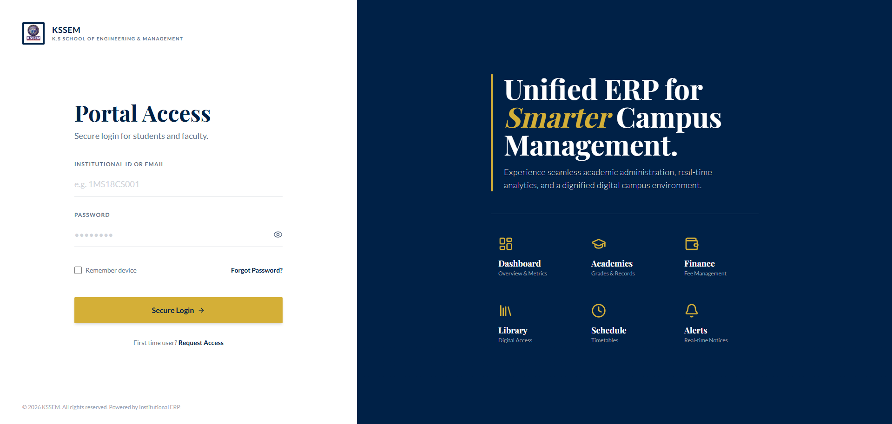
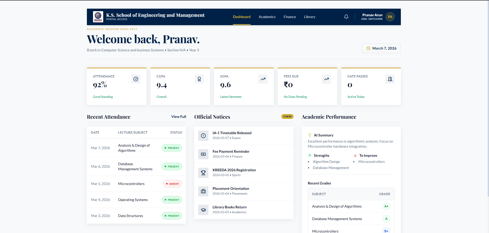
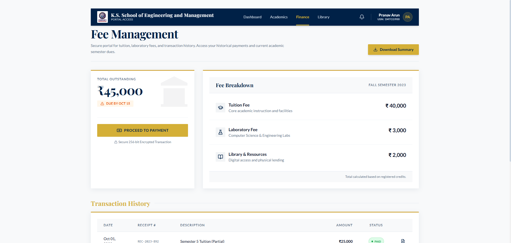
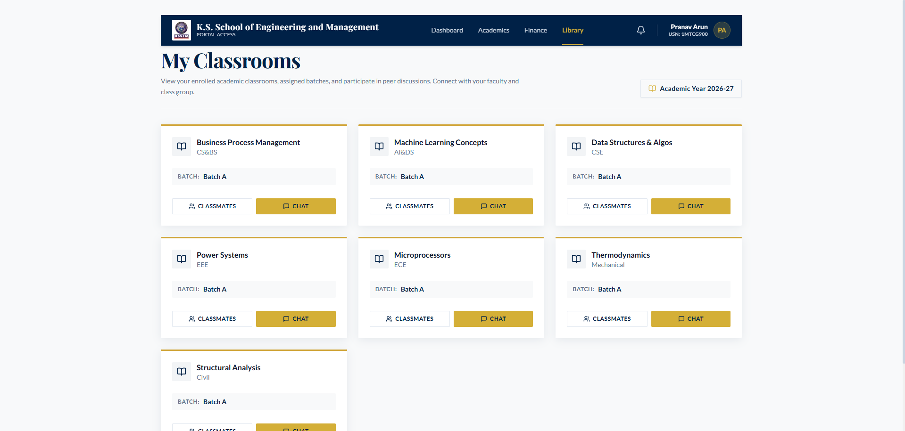

#  KSSEM College ERP System

[](https://opensource.org/licenses/MIT)


A modern full-stack College ERP system for managing student records, attendance, grades, fees, real-time classroom chat, and admin operations — built for KSSEM, Bengaluru.

## System Preview

|                  Landing Page                  |             Portal Dashboard              |
| :--------------------------------------------: | :---------------------------------------: |
|  |  |

|                Fee Management                |             Digital Classroom             |
| :------------------------------------------: | :---------------------------------------: |
|  |  |

## Architecture Overview

The application is structured as a decoupled full-stack architecture:

- **Frontend (`src/`)**: Single Page Application (SPA) built with **Vite**, **React 18**, **TypeScript**, **React Router v7**, and **TailwindCSS**. Handles UI rendering, client-side Firebase Auth state, and interacts with the Go backend over REST and Server-Sent Events (SSE).
- **Backend (`server/`)**: A modular monolith written in **Go 1.22+** using the **Chi router**, backed by Cloud Firestore and Firebase Admin SDK. Exposes clean REST APIs for all academic and administrative domains, plus an in-memory SSE event stream for real-time messaging.

### Key Highlights
- **Zero Frontend Direct Database Access**: All application data (profiles, attendance, marks, fees, chat) flows through the Go backend API.
- **Real-Time Communication**: In-memory event hub inside the Go backend streams real-time messages via **Server-Sent Events (SSE)** without requiring external brokers like Redis.
- **Role-Based Access Control**: Enforced using **Firebase Custom Claims** (`admin`, `teacher`, `student`) verified by backend middleware on protected routes (`/api/admin/*`, `/api/academic/*`).

See [`ARCHITECTURE.md`](ARCHITECTURE.md) for the complete backend architecture breakdown.

## Repository Structure

```
College-ERP/
├── public/                # Static assets, logo, favicons, PWA manifest
├── src/                   # React frontend application
│   ├── ai/                # Genkit AI workflows
│   ├── components/        # UI components (shadcn/ui & custom)
│   ├── hooks/             # Custom React hooks & TanStack Query integrations
│   ├── lib/               # Firebase client, API clients, utilities
│   ├── pages/             # Application route views & dashboards
│   └── routes/            # React Router route definitions
├── server/                # Go backend modular monolith
│   ├── internal/          # Domain packages (academic, admin, communication)
│   ├── pkg/               # Shared utilities (auth, middleware, firestore client)
│   ├── Dockerfile         # Production Docker container definition
│   └── main.go            # Go server entry point
├── scripts/               # Admin claims backfill and utility scripts
├── pnpm-workspace.yaml    # Workspace configuration & dependency overrides
└── package.json           # Frontend dependencies and scripts
```

## What You'll Need (Prerequisites)

- **Node.js** (LTS) and `pnpm`
- **Go** (1.22+) — for running the backend locally
- **Google Firebase Account** — for Firebase Authentication and Cloud Firestore
- **SMTP Email Credentials** (Optional) — for email notifications (e.g. Gmail App Password, SendGrid)

## Initial Setup Guide

### Step 1: Install Node.js, pnpm, and Go

1. Install Node.js LTS from [nodejs.org](https://nodejs.org/).
2. Install pnpm: `npm install -g pnpm`
3. Install Go 1.22+ from [go.dev/dl](https://go.dev/dl/).
4. Verify: `node -v`, `pnpm -v`, `go version`.

### Step 2: Clone and Install Frontend Dependencies

```bash
git clone https://github.com/toxicbishop/KSSEM-College-ERP-System.git
cd KSSEM-College-ERP-System
pnpm install
```

### Step 3: Set Up Firebase Project

1. Open [Firebase Console](https://console.firebase.google.com/) and create a new project.
2. In the project dashboard, add a **Web App** (`</>`) and copy the `firebaseConfig` object values.
3. Under **Build > Authentication**, click **Get started** and enable **Email/Password**.
4. Under **Build > Firestore Database**, click **Create database** (start in production mode and select your region).

### Step 4: Deploy Firestore Security Rules

Deploy the included security rules using Firebase CLI:

```bash
npm install -g firebase-tools
firebase login
firebase use --add   # select your project
firebase deploy --only firestore:rules
```

### Step 5: Generate Firebase Service Account Key (For Backend)

1. In Firebase Console, go to **Project Settings** (gear icon) > **Service accounts**.
2. Click **Generate new private key** and download the JSON file.
3. Convert the JSON file to base64:
   - **Linux / macOS**:
     ```bash
     base64 -w 0 /path/to/serviceAccountKey.json
     ```
   - **Windows PowerShell**:
     ```powershell
     [Convert]::ToBase64String([IO.File]::ReadAllBytes("path\to\serviceAccountKey.json"))
     ```
4. Copy the resulting base64 string for use in backend configuration.

### Step 6: Configure Environment Variables

#### Frontend Configuration (`.env.local`)
Create `.env.local` in the project root:

```env
# Firebase Web Client Config (from Step 3)
NEXT_PUBLIC_FIREBASE_API_KEY=your-api-key
NEXT_PUBLIC_FIREBASE_AUTH_DOMAIN=your-project.firebaseapp.com
NEXT_PUBLIC_FIREBASE_PROJECT_ID=your-project-id
NEXT_PUBLIC_FIREBASE_STORAGE_BUCKET=your-project.appspot.com
NEXT_PUBLIC_FIREBASE_MESSAGING_SENDER_ID=your-sender-id
NEXT_PUBLIC_FIREBASE_APP_ID=your-app-id

# Points the frontend at your Go backend
NEXT_PUBLIC_API_URL=http://localhost:8080

# Optional: Google Gemini API key for Genkit AI features (from aistudio.google.com)
GOOGLE_GENAI_API_KEY=

# Optional: Google Analytics 4 Measurement ID
NEXT_PUBLIC_GA_MEASUREMENT_ID=
```

#### Backend Configuration (`server/.env`)
Create `server/.env`:

```env
PORT=8080
FIRESTORE_PROJECT_ID=your-firebase-project-id
GOOGLE_APPLICATION_CREDENTIALS_B64=your-base64-encoded-service-account-json
CORS_ALLOWED_ORIGINS=http://localhost:9002,http://localhost:3000

# Optional: SMTP Configuration for email notifications
SMTP_HOST=smtp.gmail.com
SMTP_PORT=587
SMTP_USER=
SMTP_PASS=
SMTP_FROM_ADDRESS=
```

### Step 7: Run the Go Backend Locally

From the `server/` directory:

```bash
cd server
go run .
```

Or build and execute the binary:

```bash
cd server
go build -o app .
./app
```

Or run via Docker:

```bash
docker-compose up --build
```

Verify backend health:
```bash
curl http://localhost:8080/health
# Response: {"status":"ok"}
```

### Step 8: Run the Frontend Application

From the project root:

```bash
pnpm dev
```

Open [http://localhost:9002](http://localhost:9002) in your browser.

### Step 9: Create Your First User & Promote to Admin

1. Sign up a new user through the app UI (`/signup`). This registers the user in Firebase Auth and creates a corresponding Firestore profile document via `/api/academic/profile`.
2. In Firebase Console, navigate to **Firestore Database** > `users` collection, locate the user's document (Document ID = Auth UID), and set `role` to `"admin"`.
3. Synchronize the custom claims using the backfill script:
   ```bash
   node scripts/backfill_admin_claims.js
   ```
4. Sign out and sign back in to refresh the user's JWT token with the new admin claims.

---

## Available Frontend Scripts

| Command | Description |
| :--- | :--- |
| `pnpm dev` | Starts Vite local development server on `http://localhost:9002` |
| `pnpm build` | Typechecks and compiles production build into `dist/` |
| `pnpm preview` | Serves the production build locally for verification |
| `pnpm lint` | Runs ESLint across codebase |
| `pnpm typecheck` | Validates TypeScript types (`tsc --noEmit`) |
| `pnpm genkit:dev` | Runs local Genkit AI flow developer UI |

---

## Deployment

### Frontend (Static SPA)
The frontend builds into a static bundle in `dist/`. It can be hosted on any static hosting provider (Vercel, Cloudflare Pages, Netlify, AWS S3/CloudFront, or Nginx):
- **Build Command**: `pnpm build`
- **Output Directory**: `dist`
- **SPA Routing**: Ensure URL rewrites redirect all routes (`/*`) to `/index.html`.
- **Environment Variables**: Configure all `NEXT_PUBLIC_*` variables in your provider's dashboard.

### Backend (Go Service)
The backend can be deployed as a Docker container or direct Go binary on any cloud provider (Render, Cloud Run, Railway, Fly.io, or VPS):
- **Root Directory**: `server`
- **Docker Build**: Uses `server/Dockerfile`
- **Environment Variables**: Set `PORT`, `FIRESTORE_PROJECT_ID`, `GOOGLE_APPLICATION_CREDENTIALS_B64`, and `CORS_ALLOWED_ORIGINS` (pointing to your deployed frontend domain).

---

## License

This project is licensed under the [MIT LICENSE](LICENSE).
