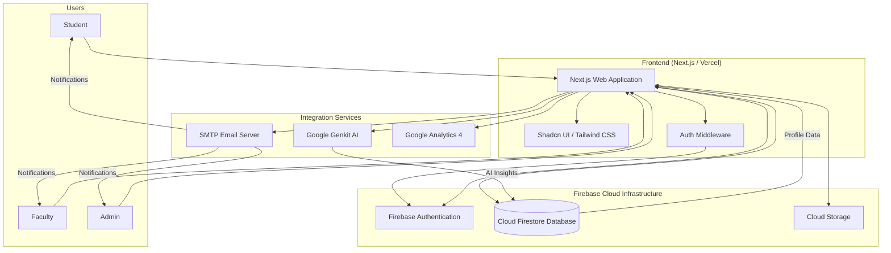

# Case Study: KSSEM College ERP System Architecture

## Overview

The KSSEM College ERP System is a modern, full-stack web application built using the Next.js framework and Firebase ecosystem. It follows a serverless architecture, leveraging Cloud Firestore for data persistence, Firebase Authentication for identity management, and Google Genkit for AI-driven insights.

## Architectural Components

### 1. Presentation Layer (Frontend)

- **Framework:** Next.js (App Router)
- **UI Components:** Shadcn UI, Tailwind CSS, Lucide React
- **Client Logic:** React Hooks, Context API (Auth, Theme)
- **Key Modules:**
  - **Public Pages:** Landing, Contact, FAQ, About.
  - **Dashboards:** Student, Faculty, and Admin interfaces.
  - **Finance Module:** Fee payment and management.
  - **Academic Services:** Grades, Attendance, Classroom, and Chat.

### 2. Service Layer (Logic & Integration)

- **Firebase SDK (Client-Side):** Direct interaction with Firestore for real-time updates and Auth.
- **Next.js API Routes (Server-Side):**
  - **Firebase Admin SDK:** Privileged operations (role management).
  - **Google Genkit:** AI flows for attendance analysis and chat features.
  - **SMTP Integration:** Sending automated notifications and alerts.

### 3. Data & Infrastructure Layer

- **Firebase Authentication:** Secure user identity and RBAC (Role-Based Access Control).
- **Cloud Firestore:** NoSQL database for structured data (Users, Attendance, Grades).
- **Cloud Storage:** (Likely for profile images/documents).
- **Google Analytics 4:** User engagement tracking.
- **Vercel / Firebase Hosting:** Continuous deployment and hosting.

## System Architecture Diagram (Mermaid)

